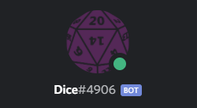
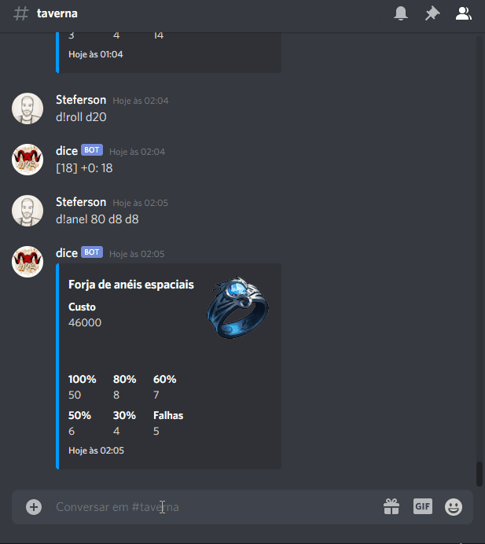
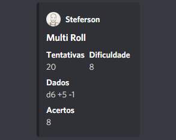
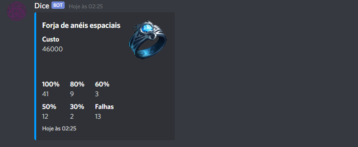
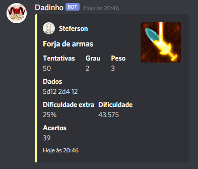

<h1 align="center">
  
   
  BOT DE ROLAGENS DE DADOS PARA DISCORD
</h1>

  

  

<h4 align="center">
  <a href="#description" >
    Descrição
  </a>
  |
  <a href="#commands" >
    Comandos
  </a>
  |
  <a href="#license" >
    Licença
  </a>
</h4>

  

 
<h2 name="description">💡 Descrição</h2>

  Bot para a plataforma <a href="https://discord.com/" target="_blank">Discord</a> que possui comandos para efetuar rolagem de dados para um RPG de mesa.

  Para que o bot funcione é necessário que o arquivo "index.js" esteja em execução (mesmo que seja em um servidor local).

  

 
<h2 name="commands">🚀 Comandos</h2>
<h3>d!roll [...dados]</h3>

  Todo conteúdo após "d!roll" é tratado como parâmetro. Palavras com inicial "d" são usadas como dados, caso contrário, são tratadas como modificadores fixos/bônus e são somadas/subtraídas do resultado final.

> d!roll d12 d6 +5 -1

  

<h3>d!mroll dificuldade quantidade [...dados]</h3>

O primeiro parâmetro é a quantidade de tentativas, o segundo parâmetro é a dificuldade das rolagens e o restante são os dados das rolagens.

> d!mroll 20 8 d6 +5 -1

  

<h3>d!anel quantidade [...dados]</h3>

  O primeiro parâmetro é quantidade de tentativas desejada e todo o restante faz parte dos dados que compõem a rolagem. Palavras com inicial "d" são usadas como dados, caso contrário, são tratadas como modificadores fixos/bônus e são somadas/subtraídas do resultado final.

> d!anel 80 d8 d8 +1 -1

  

<h3>d!status {...params}</h3>

  Exibe o status de seu respectivo personagem.

> d!status

  

---

  Altera o tamanho máximo da respectiva barra ou cria uma nova barra caso não exista.

> d!status hp:pool=60

  

---

  Soma ou subtrai o parâmetro da respectiva barra.

> d!status hp:add=5

  

---

  Altera o valor corrente da respectiva barra para o valor passado como parâmetro.

> d!status hp:current=20

  

<h3>d!forja_arma quantidade grau peso tempo_dedicado [...dados]</h3>

<b>quantidade</b> é a quantidade de tentativas realizadas <b>grau</b> é o grau da arma desejada <b>peso</b> é o peso da arma desejada <b>tempo_dedicado</b> é o tempo a mais ou a menos de dedicação para construção daquela arma, de maneira que cada unidade representa 30 minutos e influncia na dificuldade da rolagem

> d!forja_arma 50 2 3 1 5d12 2d4 12

  

 
<h2 name="license">📝 Licença</h2>

Este projeto está sob uma licença MIT. Veja mais informações em <a href="https://github.com/steferson-augusto/discord-bot-dice/blob/master/LICENSE" target="_blank">LICENSE</a>.

---

👻 Criado por <a href="https://www.linkedin.com/in/st%C3%A9ferson-augusto-4b0b9b124/" target="_blank">Stéferson Augusto</a>

